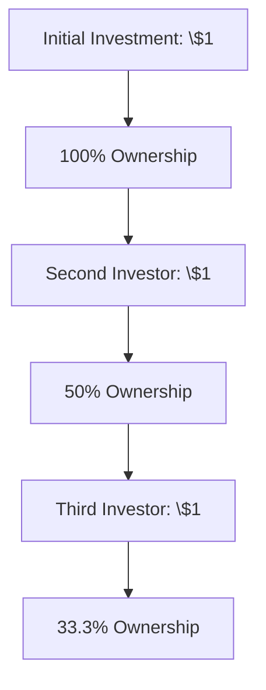

- determine voting power
- ownership model formula changes
	- Investors are automatically diluted
	- Profit sharing based on ratio after expenses
	- Expenses are assigned quarterly
# Ownership Problem

## Ownership Dilution Model
### Core Principle
Each new \$1 investment resets ownership proportions based on total capital contributed.

## Mathematical Definition
Let:
- $$ n $$ = total number of investors
- $$ P(n) $$ = your ownership percentage after $$ n $$ investments

### Base Cases
$$
\begin{aligned}
P(1) &= 1 \quad \text{(100\%)} \\
P(2) &= \frac{1}{2} \quad \text{(50\%)} \\
P(3) &= \frac{1}{3} \quad \text{(33.\overline{3}\%)}
\end{aligned}
$$

### Recurrence Relation
For the $$ n $$-th investor:
$$
P(n) = P(n-1) \times \left( \frac{n-1}{n} \right)
$$

### Closed-Form Solution
The product telescopes to:
$$
P(n) = \prod_{k=2}^{n} \left( \frac{k-1}{k} \right) = \frac{1}{n}
$$

### General Formula
$$
\boxed{P(n) = \frac{1}{n}}
$$

## Ownership Table
| Investors (n) | Total Capital | Your Ownership |
|---------------|---------------|-----------------|
| 1             | \$1           | $$ \frac{1}{1} $$ |
| 2             | \$2           | $$ \frac{1}{2} $$ |
| 3             | \$3           | $$ \frac{1}{3} $$ |
| 4             | \$4           | $$ \frac{1}{4} $$ |
| n             | \$n           | $$ \frac{1}{n} $$ |

## Key Properties
1. **First Investor Advantage**:  
   $$ \lim_{n \to 1} P(n) = 1 $$

2. **Asymptotic Behavior**:  
   $$ \lim_{n \to \infty} P(n) = 0 $$

3. **Relative Dilution**:  
   Each new investor reduces your ownership by factor $$ \frac{n}{n+1} $$

## Comparison to Standard Models
Traditional equity dilution follows:
$$
P_{\text{standard}}(n) = \prod_{k=1}^{n} \left( 1 - \frac{i_k}{V_k} \right)
$$
where $$ i_k $$ = investment amount, $$ V_k $$ = valuation at round $$ k $$.

## Visualization (Mermaid)

# 